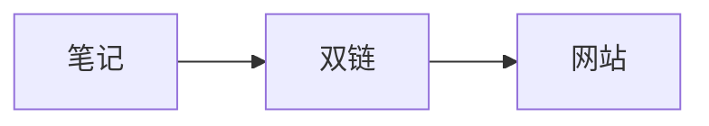

这是一篇用于验证 Quartz 功能的测试笔记。

## 双链

从 [[双链测试]] 跳转回来。

## Callout

> [!note] 提示
> 这是 Obsidian 风格的 Callout 语法

## 代码块

```python
def hello():
    print("Hello, 数字花园!")
```

## 表格

| 功能 | 状态 |
| --- | --- |
| 双链 | 支持 |
| 全文搜索 | 支持 |
| 暗色模式 | 支持 |

## 公式

质能方程 $E=mc^2$ 是行内公式。

$$
a^2 + b^2 = c^2
$$

## Mermaid 图



> 测试完毕，验证通过后可以删除这些文件。
